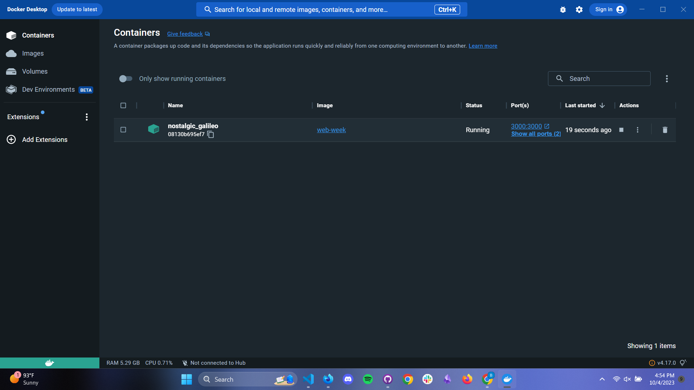
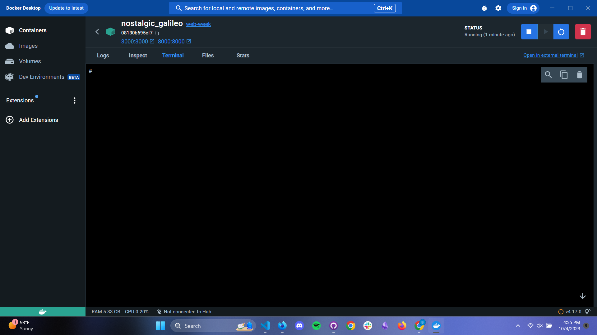

## Web Week Repo

This is the repository for the GDSC x Fast Web-Week demo.

# Getting started
To participate in this challenge, please follow the steps below:
1. [Install Docker Desktop](https://www.docker.com/products/docker-desktop/)
2 Download the docker image:

```bash
docker pull blbergo/web-week
```

3. Start the servers with the command below:

```bash
docker run -it -p 3000:3000 -p 8000:8000 --init blbergo/web-week
```

4. Inspect the running container by clicking on it in Docker Desktop


5. Access the file system using the terminal, and try to find as many flags as you can!
